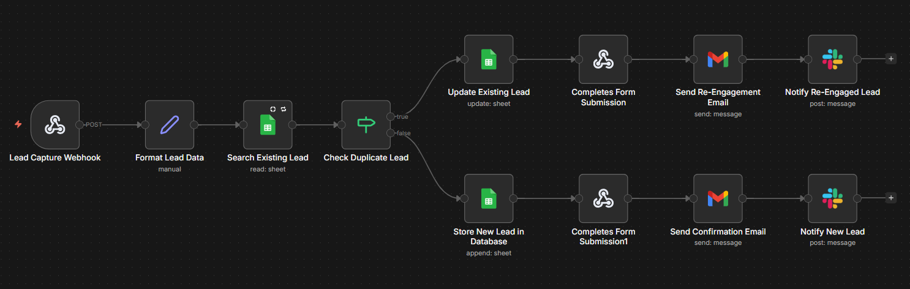
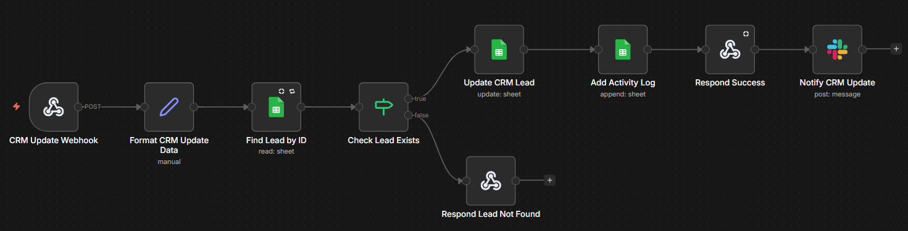
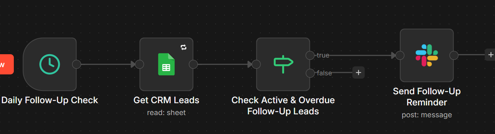
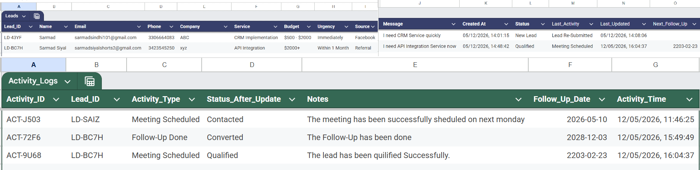
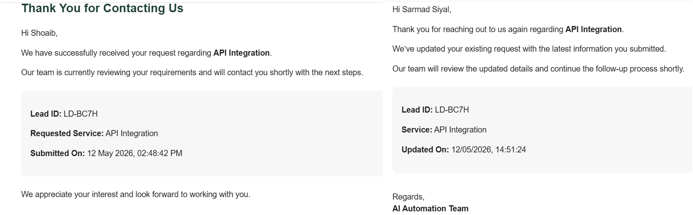
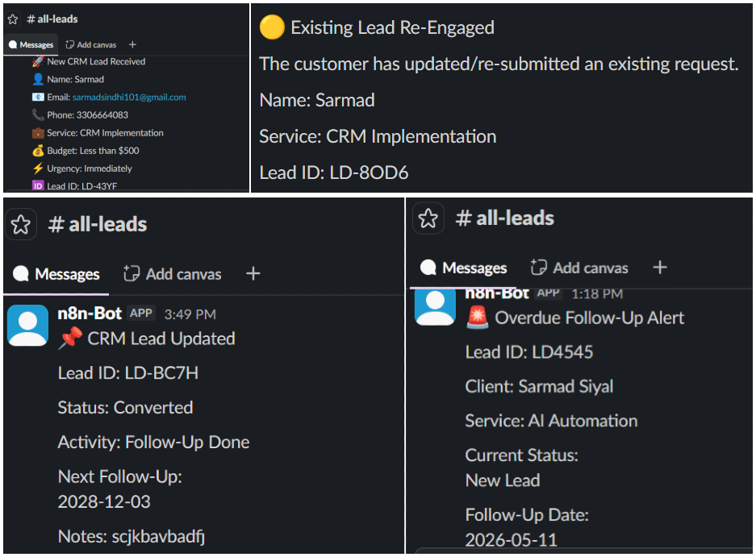
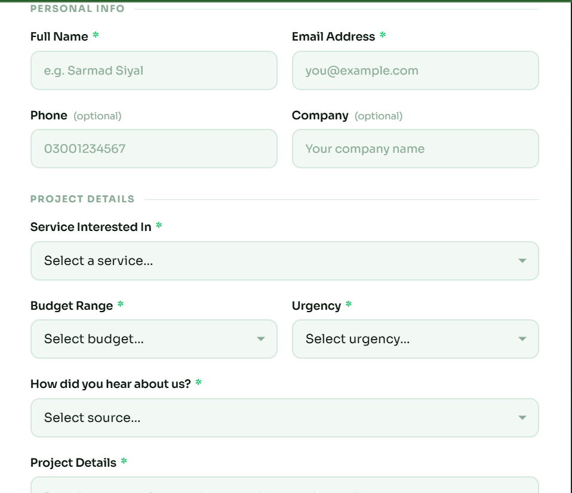
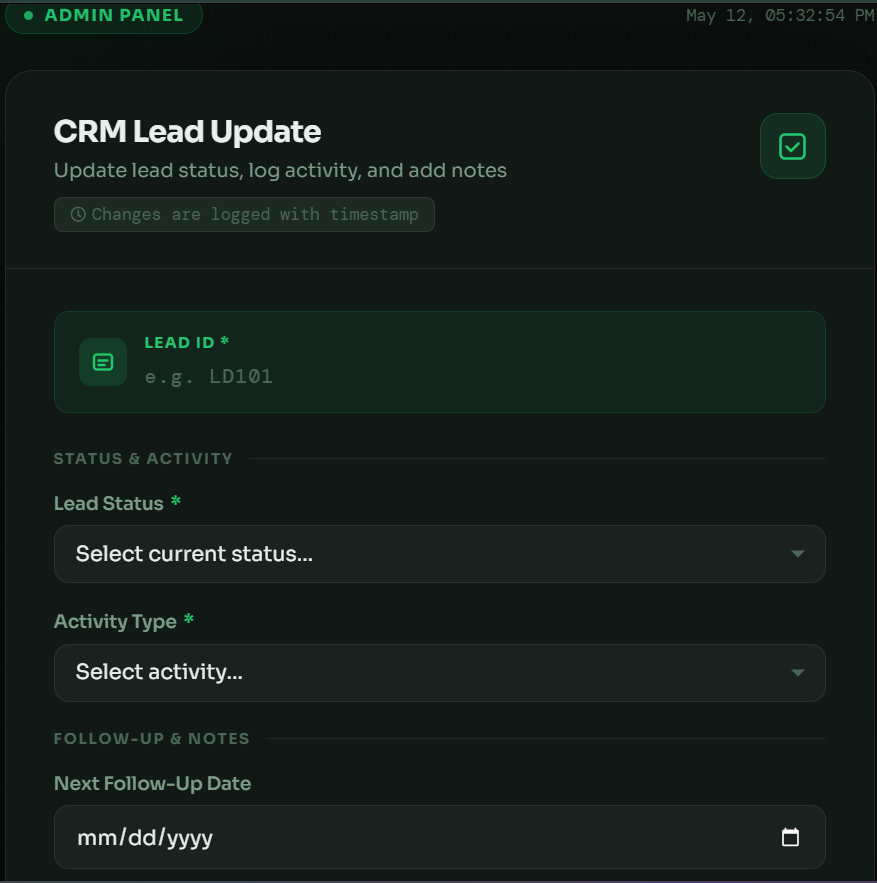

# CRM Automation System using n8n

## Overview

This project is a complete CRM Automation System built using **n8n**, **Google Sheets**, **Gmail**, **Slack**, and **Webhooks**.

The system automates:

- Lead capture
- Duplicate lead detection
- CRM management
- Activity tracking
- Follow-up reminders
- Email notifications
- Slack notifications

This project was built as part of the **Day 7–8 CRM Integration & Tracking Automation Task**.

---

# Features

## Lead Capture Automation

- Capture leads from HTML form
- Store leads in Google Sheets CRM
- Prevent duplicate lead creation
- Update existing leads automatically
- Send professional confirmation emails
- Notify internal team using Slack

---

## CRM Lead Management

- Admin CRM update form
- Lead status management
- Activity tracking
- Follow-up scheduling
- CRM update notifications
- Lead existence validation

---

## Automated Follow-Up Tracking

- Daily automated follow-up checks
- Detect overdue leads
- Notify internal team automatically
- Improve CRM follow-up management

---

# Technologies Used

| Technology | Purpose |
|---|---|
| n8n | Workflow automation |
| Google Sheets | CRM database |
| Gmail | Email notifications |
| Slack | Internal notifications |
| HTML/CSS/JavaScript | Frontend forms |
| Webhooks | Form communication |

---

# Repository Structure

```bash
crm-automation-system/
│
├── workflows/
│   ├── 01-lead-capture-duplicate-management.json
│   ├── 02-crm-management-activity-tracking.json
│   └── 03-followup-reminder-system.json
│
├── assets/
│   ├── workflow-1-lead-capture.png
│   ├── workflow-2-crm-management.png
│   ├── workflow-3-followup-reminder.png
│   ├── google-sheets-crm.png
│   ├── gmail-notification.png
│   ├── slack-notification.png
│   ├── admin-form.png
│   └── lead-form.png
│
├── forms/
│   ├── lead-capture-form.html
│   └── admin-crm-update-form.html
│
├── README.md
│
└── .gitignore
```

---

# Workflow 1
# Lead Capture & Duplicate Management

## Purpose

This workflow handles:

- Lead form submissions
- Duplicate lead detection
- CRM lead creation
- Existing lead updates
- Email communication
- Slack notifications

---

## Workflow Preview

```markdown
/assets/workflow-1-lead-capture.png
```



---

## Workflow Logic

```text
Webhook
↓
Format Lead Data
↓
Search Existing Lead
↓
Check Duplicate Lead
├── TRUE → Update Existing Lead
│            ↓
│       Send Re-Engagement Email
│            ↓
│       Slack Notification
│
└── FALSE → Store New Lead
             ↓
        Send Confirmation Email
             ↓
        Slack Notification
```

---

# Workflow 2
# CRM Lead Management & Activity Tracking

## Purpose

This workflow allows admins to:

- Update CRM leads
- Track CRM activities
- Schedule follow-ups
- Maintain CRM records

---

## Workflow Preview

```markdown
/assets/workflow-2-crm-management.png
```



---

## Workflow Logic

```text
CRM Update Webhook
↓
Format CRM Update Data
↓
Find Lead by ID
↓
Check Lead Exists
├── TRUE → Update CRM Lead
│            ↓
│       Add Activity Log
│            ↓
│       Slack Notification
│
└── FALSE → Respond Lead Not Found
```

---

# Workflow 3
# Automated Follow-Up Reminder System

## Purpose

This workflow automatically:

- Detects overdue follow-ups
- Identifies inactive leads
- Sends internal reminders

---

## Workflow Preview

```markdown
/assets/workflow-3-followup-reminder.png
```



---

## Workflow Logic

```text
Schedule Trigger
↓
Get CRM Leads
↓
Check Active & Overdue Leads
↓
Slack Reminder Notification
```

---

# CRM Database Structure

## CRM_Leads Sheet

| Column Name | Description |
|---|---|
| Lead_ID | Unique lead ID |
| Name | Customer name |
| Email | Customer email |
| Phone | Phone number |
| Company | Company name |
| Service | Requested service |
| Budget | Customer budget |
| Urgency | Lead urgency |
| Source | Lead source |
| Message | Customer inquiry |
| Status | CRM status |
| Last_Activity | Latest activity |
| Next_Follow_Up | Next follow-up date |
| Created_At | Lead creation time |
| Updated_At | Last update time |

---

## Activity_Logs Sheet

| Column Name | Description |
|---|---|
| Activity_ID | Unique activity ID |
| Lead_ID | Related lead |
| Activity_Type | Activity performed |
| Status_After_Update | Updated status |
| Notes | Admin notes |
| Follow_Up_Date | Follow-up date |
| Activity_Time | Activity timestamp |

---

# Lead ID Generation

Lead IDs are generated only for completely new leads.

## Format

```javascript
CRM-{{ Math.random().toString(36).substring(2,6).toUpperCase() }}
```

## Example

```text
CRM-A7F2
```

---

# Activity ID Generation

## Format

```javascript
ACT-{{ Math.random().toString(36).substring(2,).toUpperCase() }}
```

## Example

```text
ACT-K2P8
```

---

# Duplicate Lead Logic

Duplicate matching uses:

- Email
- Service

## Why?

Because the same customer can request multiple services.

### Example

| Email | Service | Result |
|---|---|---|
| ali@gmail.com | AI Automation | Existing Lead |
| ali@gmail.com | Web Development | New Lead |

---

# Screenshots

## Google Sheets CRM



---

## Gmail Notification



---

## Slack Notification



---

## Lead Capture Form



---

## Admin CRM Update Form



---

# Setup Instructions

## 1. Clone Repository

```bash
git clone https://github.com/your-username/crm-automation-system.git
```

---

## 2. Import Workflows into n8n

Import all JSON workflow files from:

```bash
/workflows
```

---

## 3. Configure Credentials

Add credentials for:

- Google Sheets
- Gmail
- Slack

---

## 4. Create Google Sheets Database

Create:

- CRM_Leads sheet
- Activity_Logs sheet

using the provided column structure.

---

## 5. Update Webhook URLs

Replace webhook URLs inside HTML forms with your own n8n webhook URLs.

---

# Final Outcome

This project demonstrates a complete production-style CRM automation system using n8n.

The system successfully automates:

- Lead capture
- Duplicate handling
- CRM management
- Activity tracking
- Follow-up reminders
- Team notifications
- Customer communication

---

# Author

Developed as part of the CRM Integration & Tracking Automation Task using n8n.

---

## 📌 Notes

This project is part of the AI Automation Internship probation tasks (Day 4–5).

Credentials are not included in this workflow. Please configure your own Google Sheets and Gmail credentials before running.
